# Project-7-NYC-Uber-Data-Engineering-Pandas-Pyspark

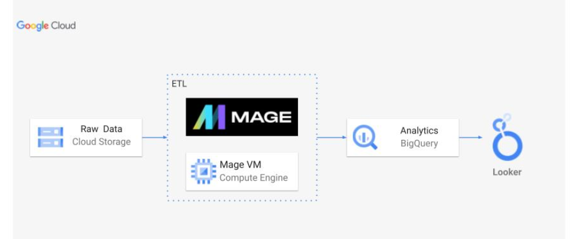


# Introduction - 
This Data Analytics/Data Engineering project involves normalizing/denormalizing existing data for various purposes. I created a data model and visualized it. The transformation steps needed for establishing the data model have been completed using Pandas and Mage. Analytical queries using SQL on BigQuery have been written. Employing SQL joins, I have denormalized the data essential for our dashboard. The final step involves creating our analytics dashboard.

# Tech stack used - 
1. Python - Used the famous Pandas library
2. Jupyter Notebook in VS Code as my Code Editor
3. Lucid Chart to visualize the Data Model
4. Google Cloud Storage
5. Google Cloud's Bigquery
6. Google Cloud's Compute Engine
7. Looker Studio

# How to deploy it yourself? 👇
1. Clone this repository and place it in your working directory.
2. Run the analytics.ipynb file and it will create your fact and dimension tables as shown in the data model diagram below.
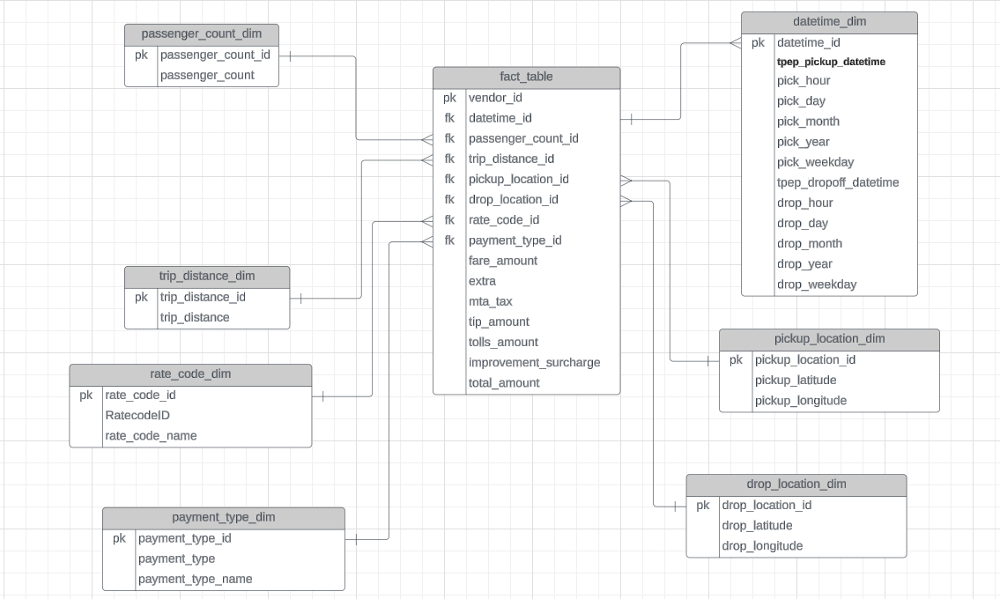

3. Now the local work is done, it's time to move to Google Cloud Platform🍻.
4. In the Google Cloud Console create a VM under the Compute Engine section with the following configruations-
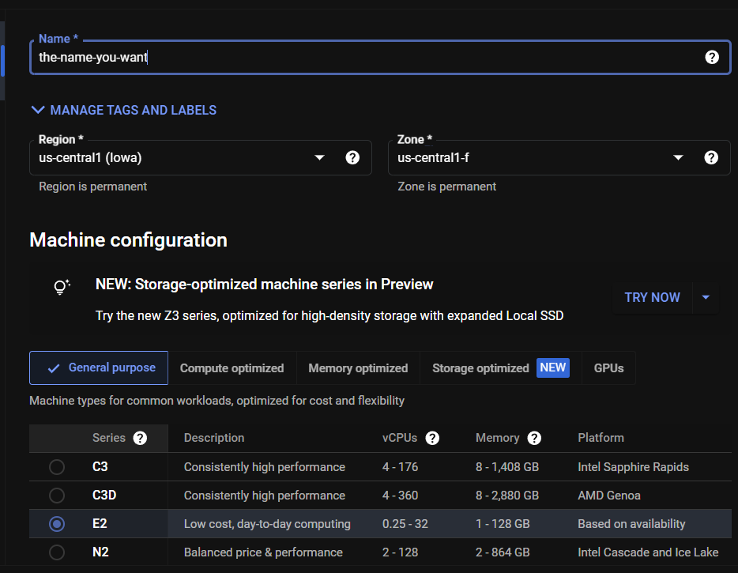

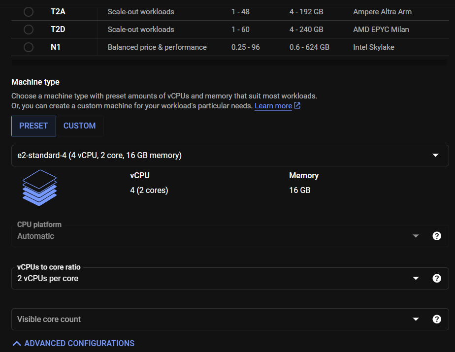

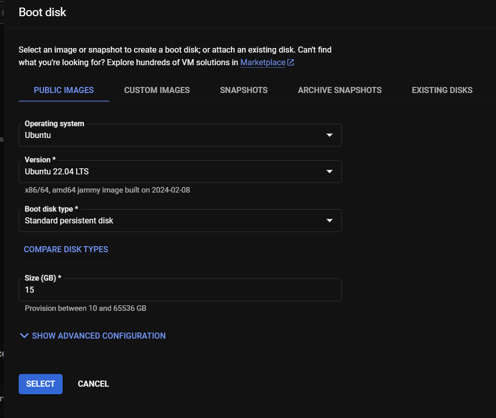


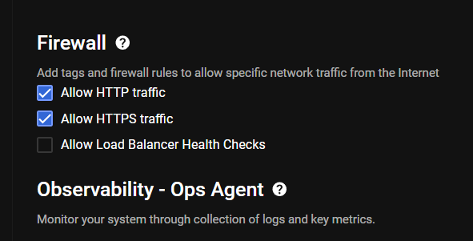

5. After the VM is up and running, SSH into it and run the following commands -
```
sudo apt-get update
sudo apt install python3-pip
pip install google-cloud-aiplatform
pip install mage-ai
```
6. Now give the VM a restart by stopping and starting it.
7. Again SSH into it and enter the following command -
```
mage start <YOUR-PROJECT-NAME>
```
8. You will see the following in your SSH terminal.
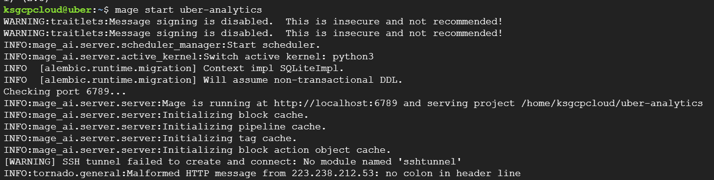

9. Now open a new tab in your browser and put the following link -
```
<YOUR-VM-EXTERNAL-IP>:6789
```
10. The link won't work... hahah... Bummer!!! Let's get it to work.
11. In the internal IP section of your VM, click on the 'nic0' link.
12. You will get redirected to Network Interface details section. on the left panel click on the firewall section.
13. In the upper panel click on the 'Create Firewall Rule'.
14. Enter the following settings -

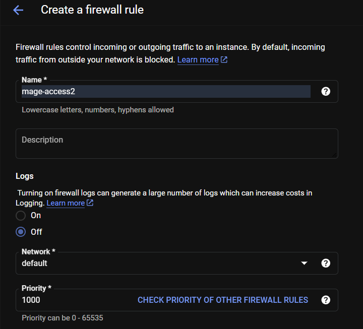


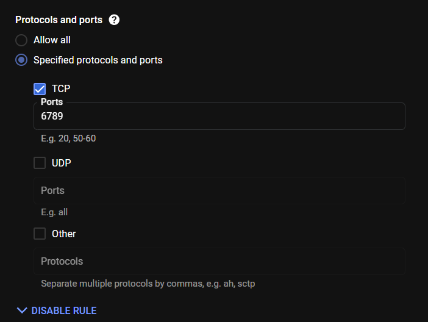

16. Now click on create. You should now be able to access Mage from the same link you used earlier in step 9.
17. You will see the Mage UI like below. Click on the 'New' button, then click on Standard(batch) button.
18. Click on the 'Data Loader' button -> 'Python' -> 'API'.
19. Give it a name and click on 'Save and add'.
20. Now we need the link to our csv data to put it in the code so create a bucket in google cloud storage, make it public and put it's link in the 'Data-Loader.py' file in the mage folder.
21. Paste the code in the 'Data Loader' section in Mage.
22. Now below the 'Data Loader' section, click on the 'Transformer' button -> Python -> Generic(no template).
23. Paste the code from 'transformation.py' file in the mage folder.
24. Now click on the 'Data Exporter' button below the 'Transformer' code and paste the code in 'Data-Exporter.py' file in the mage folder.
25. To be able to export data into Bigquery we need a Service Account. Create a service account and put it's credentials in the 'io_config.yaml' file in Mage.

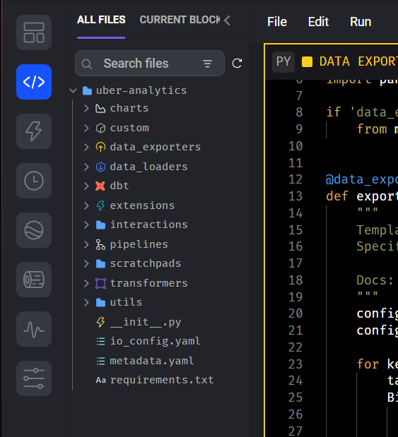


26. Now after the credentials are set, create a dataset in Bigquery and paste it's information accordingly in the 'Data-Exporter.py' code. Now run each cell of loader, transformation and exporter. You will get your data loaded in Bigquery like this.


# Extra - 
1. Now you can run some analytical SQL queries like the ones shown below -

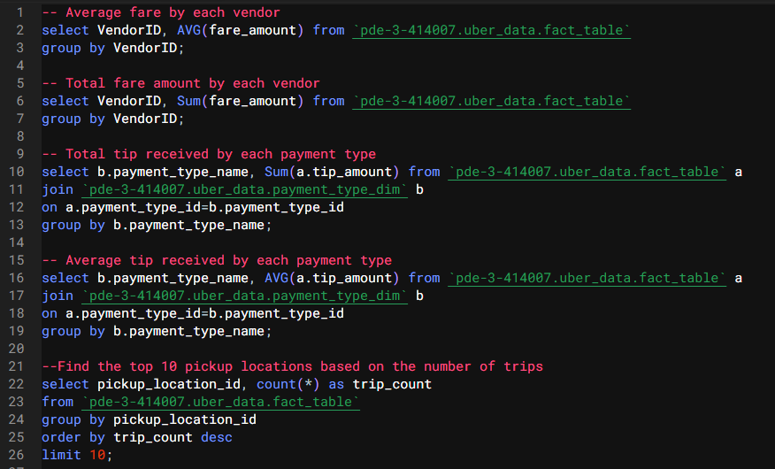

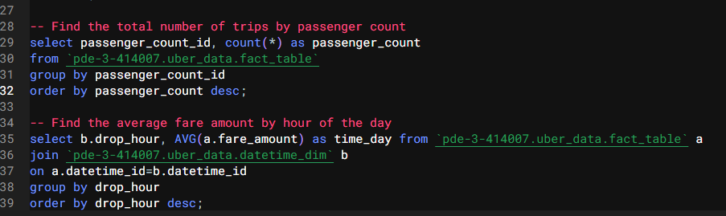

2. Now we can also utilize Bigquery to build a Dasboard, but to do so we need a table which has all the columns we need to make it. In order to do that we run the following SQL query - 


3. We can make a dashboard like the one below -


### Thank you for reading till here. I hope you implemented this as well🫠

#### Have a nice day🍻

# Pyspark Update 🍻 - 
Here we will be replacing the transformations that we did earlier using pandas with pyspark. The newly updated files are in the 'Mage-Files-Pyspark' folder in this repository.

### How to do it??🤔
1. Restart the VM.
2. First we need to install Spark in our VM because Pyspark is just a python wrapper around the acutal Spark which is in Java. To do so refer to this link -> [Click Here](https://linuxgenie.net/how-to-install-apache-spark-on-ubuntu-22-04/)
3. Now install pyspark using the following command -
```
pip install pyspark
```
4. Now we will have to install pyspark compatible Mage on our VM. To do so please refer to this official link by Mage (You need very basic understanding of Docker and very basic Docker commands) -> [Click Here](https://docs.mage.ai/integrations/spark-pyspark)
5. After you have successfully installed Pyspark-Mage in the VM, use the following command to start Mage.
```
sudo docker run -it --name mage_spark -e SPARK_MASTER_HOST='local' -p 6789:6789 -v $(pwd):/home/src mage_spark   /app/run_app.sh mage start <YOUR-PROJECT-NAME-USED-EARLIER>
```
6. This will start Mage with our project we had earlier created. Check again Mage's UI whose port we had configured in our VM before by using this link -
```
<EXTERNAL-IP-ADDRESS-OF-YOUR-VM:6789>
```
7. If all the above steps are successful, we can now start using pyspark for the tranformations.
8. In Mage's UI, create a new pipeline and name it whatever you want.
9. Now in the edit pipeline section add a scratchpad section shown below👇

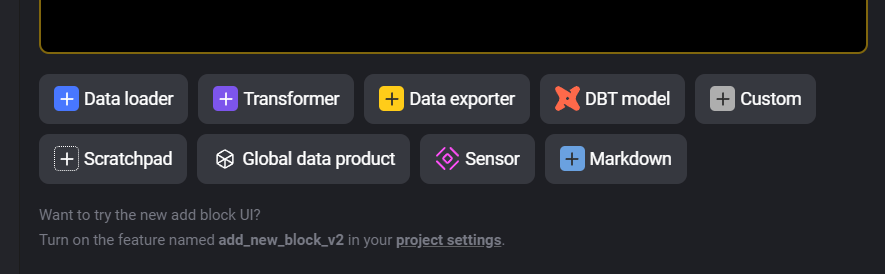

10. Paste the code written in scratchpad.py file provided in the Mage-Files-Pyspark folder.
11. Now create Data Loader Section and simply paste the code provided in data-loader.py file in Mage-Files-Pyspark folder.
12. Next create the Transformer Section and again paste the code provided in transformer.py file in Mage-Files-Pyspark folder.
13. To put the nail in the coffin create the Data Exporter Section and paste the code provided in data-exporter.py file in Mage-Files-Pyspark folder.
14. You will have to make the necessary changes in the above code files according to your Google Cloud and Service Account credentials.
15. After everything is done, the final page should look like this👇

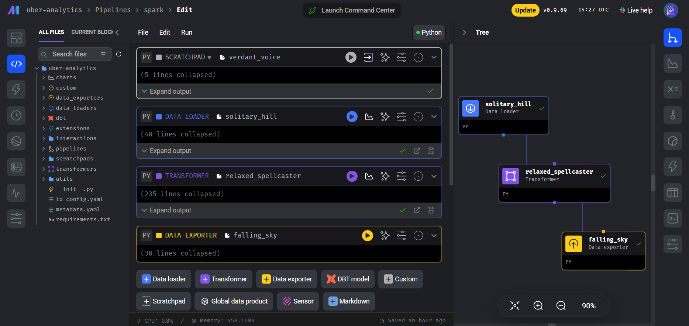

16. The steps that need to be followed after this are mentioned above this section in this README file👆👆

### Thank You again👋👋


