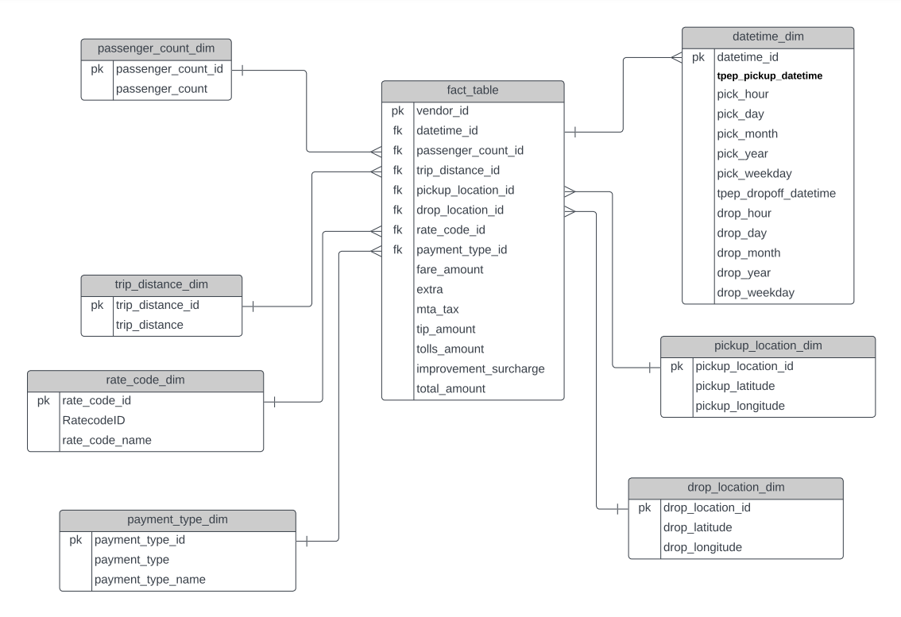
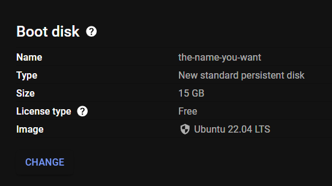

# Project-7-NYC-Uber-Data-Engineering

# Introduction - 
This Data Analytics/Data Engineering project involves normalizing/denormalizing existing data for various purposes. I have already created a data model and visualized it. The transformation steps needed for establishing the data model have been completed using Pandas and Mage. Analytical queries using SQL on BigQuery have been written. Employing SQL joins, I have denormalized the data essential for our dashboard. The final step involves creating our analytics dashboard.

# Tech stack used - 
1. Python - Used the famous Pandas library
2. Jupyter Notebook in VS Code as my Code Editor
3. Lucid Chart to visualize the Data Model
4. Google Cloud Storage
5. Google Cloud's Bigquery
6. Google Cloud's Compute Engine
7. Looker Studio

# How to deploy it yourself? 👇
1. Clone this repository and place it in your working directory.
2. Run the analytics.ipynb file and it will create your fact and dimension tables as shown in the data model diagram below.


3. Now the local work is done, it's time to move to Google Cloud Platform🍻.
4. In the Google Cloud Console create a VM under the Compute Engine section with the following configruations-





5. After the VM is up and running, SSH into it and run the following commands -
```
sudo apt-get update
sudo apt install python3-pip
pip install mage-ai
```
6. Now give the VM a restart by stopping and starting it.
7. Again SSH into it and enter the following command -
```
mage start <YOUR-PROJECT-NAME>
```
8. You will see the following in your SSH terminal.

